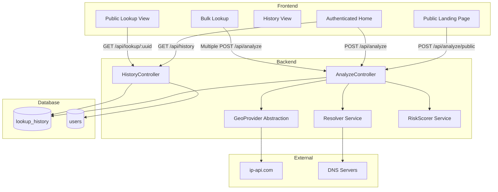

# Design Document: LinkGuard Pivot

## Overview

LinkGuard transforms the existing GeoTracker application from a simple IP geolocation tool into a comprehensive network intelligence platform. The system accepts diverse input types (emails, URLs, domains, raw IPs), resolves them to IP addresses, enriches the results with ISP/proxy/hosting intelligence, assigns risk scores, and persists lookup history with shareable public URLs.

### Key Design Goals

1. **Unified Input Processing**: Single endpoint handles all target types (email, URL, domain, IP)
2. **Intelligent Resolution**: DNS-based resolution strategy adapts to input type
3. **Risk Intelligence**: Deterministic scoring algorithm based on network characteristics
4. **Persistent History**: Database-backed lookup records with UUID-based public sharing
5. **Public Access**: Unauthenticated landing page for instant IP lookup
6. **Backward Compatibility**: Preserve existing GeoTracker functionality while adding new features

### Technology Stack

- **Frontend**: React 18, react-router-dom, axios, MapLibre GL, Tailwind CSS
- **Backend**: Laravel 11, Sanctum authentication, HTTP client
- **Database**: MySQL/PostgreSQL (Laravel migrations)
- **External APIs**: ip-api.com (primary), ipinfo.io (fallback option)
- **DNS Resolution**: PHP native functions (`dns_get_record`, `gethostbyname`)

---

## Architecture

### System Architecture Diagram



### Backend Architecture

#### Controller Layer

**AnalyzeController**
- Handles `POST /api/analyze` (authenticated) and `POST /api/analyze/public` (unauthenticated)
- Validates input target format
- Orchestrates resolution → enrichment → scoring → persistence pipeline
- Returns unified response structure

**HistoryController**
- Handles `GET /api/history` (user's lookup history)
- Handles `GET /api/lookup/{uuid}` (public lookup view)
- Handles `PATCH /api/history/{id}` (update label)
- Handles `DELETE /api/history/{id}` (delete single record)
- Handles `DELETE /api/history` (delete all user records)
- Enforces ownership authorization for authenticated endpoints

#### Service Layer

**Resolver Service**
- Detects target type (IP, domain, URL, email)
- Performs DNS resolution based on type:
  - **IP**: Validates format, returns as-is
  - **Domain**: A-record lookup via `dns_get_record(DNS_A)`
  - **URL**: Extracts hostname, then A-record lookup
  - **Email**: Extracts domain, MX-record lookup, then A-record on mail server hostname
- Returns resolved IP(s) and DNS records
- Handles resolution failures with descriptive errors
- Validates against private IP ranges (10.x, 172.16-31.x, 192.168.x, 127.x)

**GeoProvider Abstraction**
- Interface for geolocation API providers
- Default implementation: `IpApiProvider`
- Fetches enriched geo data: lat, lon, city, country, ISP, org, ASN, proxy/hosting/mobile flags, timezone
- Handles API failures and rate limits
- Returns standardized response structure
- Future: Support for ipinfo.io, ipgeolocation.io

**RiskScorer Service**
- Accepts GeoProvider response
- Applies deterministic scoring algorithm:
  - `HIGH`: proxy=true OR (hosting=true AND proxy=true)
  - `MEDIUM`: hosting=true AND proxy=false
  - `LOW`: proxy=false AND hosting=false AND geo data present
  - `UNKNOWN`: No usable geo data
- Returns risk level enum: `LOW`, `MEDIUM`, `HIGH`, `UNKNOWN`

#### Data Access Layer

**LookupHistory Model**
- Eloquent model for `lookup_history` table
- Relationships: `belongsTo(User)`
- Scopes: `forUser($userId)`, `recent()`
- Accessors: `result` (JSON cast), `created_at` (Carbon)

### Frontend Architecture

#### Component Structure

```
src/
├── pages/
│   ├── Landing.js          # Public landing page (/)
│   ├── Home.js             # Authenticated home (/home)
│   ├── PublicLookup.js     # Public result view (/lookup/:uuid)
│   └── Login.js            # Existing login page
├── components/
│   ├── ResultCard.js       # Unified result display
│   ├── RiskBadge.js        # Risk level badge
│   ├── HistoryList.js      # Lookup history table
│   ├── BulkLookup.js       # Bulk input textarea + results table
│   ├── GeoMap.js           # Existing map component
│   └── CopyButton.js       # Copy-to-clipboard utility
├── services/
│   ├── api.js              # Axios instance (existing)
│   └── riskScorer.js       # Frontend risk scoring logic
└── utils/
    ├── formatters.js       # Date, IP, country flag formatters
    └── validators.js       # Input validation helpers
```

#### Key Components

**ResultCard**
- Displays target, resolved IP, geo data, risk badge, map
- Shows "Copy link" button for shareable UUID URL
- Renders country flag emoji from countryCode
- Displays local time at target location
- Reusable across Landing, Home, PublicLookup

**RiskBadge**
- Color-coded badge: green (LOW), amber (MEDIUM), red (HIGH), grey (UNKNOWN)
- Tooltip with risk explanation
- Consistent styling across all views

**HistoryList**
- Table view of user's lookup history
- Columns: Target, Label, City, Country, Risk, Timestamp
- Inline label editing (PATCH /api/history/{id})
- Delete button per row
- "Copy link" button per row
- Relative timestamps ("2 hours ago")

**BulkLookup**
- Textarea for newline-separated targets
- Concurrent request limiter (max 10 simultaneous)
- Results table with inline errors for failed resolutions
- Export to CSV button

#### Routing

```javascript
<Routes>
  <Route path="/" element={<Landing />} />
  <Route path="/login" element={<Login />} />
  <Route path="/home" element={<ProtectedRoute><Home /></ProtectedRoute>} />
  <Route path="/lookup/:uuid" element={<PublicLookup />} />
</Routes>
```

---

## Components and Interfaces

### API Contracts

#### POST /api/analyze

**Authentication**: Required (Sanctum token)

**Request Body**:
```json
{
  "target": "example.com | user@example.com | https://example.com | 8.8.8.8"
}
```

**Response (200)**:
```json
{
  "target": "user@example.com",
  "type": "email",
  "resolved_ip": "142.250.185.27",
  "geo": {
    "query": "142.250.185.27",
    "status": "success",
    "country": "United States",
    "countryCode": "US",
    "region": "CA",
    "regionName": "California",
    "city": "Mountain View",
    "zip": "94043",
    "lat": 37.4192,
    "lon": -122.0574,
    "timezone": "America/Los_Angeles",
    "isp": "Google LLC",
    "org": "Google LLC",
    "as": "AS15169 Google LLC",
    "proxy": false,
    "hosting": true,
    "mobile": false
  },
  "risk_level": "MEDIUM",
  "dns_records": [
    {
      "type": "MX",
      "host": "example.com",
      "target": "mail.example.com",
      "priority": 10
    },
    {
      "type": "A",
      "host": "mail.example.com",
      "ip": "142.250.185.27"
    }
  ],
  "uuid": "550e8400-e29b-41d4-a716-446655440000",
  "created_at": "2026-03-15T10:30:00Z"
}
```

**Error Responses**:
- `422`: Invalid target format or private IP range
- `404`: DNS resolution failed (no records found)
- `500`: GeoProvider API failure

#### POST /api/analyze/public

**Authentication**: None

**Request/Response**: Identical to `/api/analyze` except:
- No `uuid` or `created_at` in response (not persisted)
- Rate limited to 10 requests per minute per IP

#### GET /api/history

**Authentication**: Required

**Response (200)**:
```json
{
  "data": [
    {
      "id": 123,
      "target": "example.com",
      "type": "domain",
      "resolved_ip": "93.184.216.34",
      "risk_level": "LOW",
      "label": "Example domain test",
      "result": { /* full geo object */ },
      "uuid": "550e8400-e29b-41d4-a716-446655440000",
      "created_at": "2026-03-15T10:30:00Z"
    }
  ],
  "meta": {
    "total": 50,
    "per_page": 50
  }
}
```

#### GET /api/lookup/{uuid}

**Authentication**: None

**Response (200)**: Same structure as single history item

**Error**: `404` if UUID not found

#### PATCH /api/history/{id}

**Authentication**: Required

**Request Body**:
```json
{
  "label": "Suspicious login attempt"
}
```

**Response (200)**: Updated history item

**Error**: `403` if record doesn't belong to user

#### DELETE /api/history/{id}

**Authentication**: Required

**Response (200)**:
```json
{
  "message": "Lookup deleted successfully"
}
```

**Error**: `403` if record doesn't belong to user

#### DELETE /api/history

**Authentication**: Required

**Response (200)**:
```json
{
  "message": "All lookups deleted successfully",
  "deleted_count": 42
}
```

### Service Interfaces

#### Resolver Service

```php
interface ResolverInterface
{
    public function resolve(string $target): ResolverResult;
}

class ResolverResult
{
    public string $type;           // 'ip', 'domain', 'url', 'email'
    public string $resolvedIp;     // Primary resolved IP
    public array $dnsRecords;      // Raw DNS records
    public ?string $error;         // Error message if resolution failed
}
```

**Resolution Strategy**:

1. **IP Detection**: Regex match for IPv4/IPv6 → validate → return as-is
2. **URL Detection**: Regex match for `http(s)://` → extract hostname → A-record lookup
3. **Email Detection**: Regex match for `@` → extract domain → MX-record lookup → A-record on mail server
4. **Domain Detection**: Default case → A-record lookup

**PHP Implementation**:
```php
// A-record lookup
$records = dns_get_record($domain, DNS_A);
$ip = $records[0]['ip'] ?? null;

// MX-record lookup
$records = dns_get_record($domain, DNS_MX);
$mailServer = $records[0]['target'] ?? null;
// Then resolve mail server to IP via A-record
```

#### GeoProvider Interface

```php
interface GeoProviderInterface
{
    public function lookup(string $ip): GeoResult;
}

class GeoResult
{
    public string $status;         // 'success' or 'fail'
    public ?string $message;       // Error message if status=fail
    public ?string $query;         // Queried IP
    public ?string $country;
    public ?string $countryCode;
    public ?string $region;
    public ?string $regionName;
    public ?string $city;
    public ?string $zip;
    public ?float $lat;
    public ?float $lon;
    public ?string $timezone;
    public ?string $isp;
    public ?string $org;
    public ?string $as;            // ASN
    public ?bool $proxy;
    public ?bool $hosting;
    public ?bool $mobile;
}
```

#### RiskScorer Service

```php
class RiskScorer
{
    public function score(GeoResult $geo): string
    {
        if ($geo->status !== 'success' || !$geo->query) {
            return 'UNKNOWN';
        }
        
        if ($geo->proxy === true) {
            return 'HIGH';
        }
        
        if ($geo->hosting === true && $geo->proxy === false) {
            return 'MEDIUM';
        }
        
        if ($geo->proxy === false && $geo->hosting === false) {
            return 'LOW';
        }
        
        return 'UNKNOWN';
    }
}
```

---

## Data Models

### lookup_history Table Schema

```php
Schema::create('lookup_history', function (Blueprint $table) {
    $table->id();
    $table->foreignId('user_id')->constrained()->onDelete('cascade');
    $table->string('type', 20);           // 'ip', 'domain', 'url', 'email'
    $table->string('target', 500);        // Original input
    $table->string('resolved_ip', 45);    // IPv4 or IPv6
    $table->json('result');               // Full GeoResult + dns_records
    $table->string('risk_level', 20);     // 'LOW', 'MEDIUM', 'HIGH', 'UNKNOWN'
    $table->uuid('uuid')->unique();       // For public sharing
    $table->string('label', 100)->nullable();  // User-defined label
    $table->timestamps();
    
    $table->index(['user_id', 'created_at']);
    $table->index('uuid');
});
```

**Indexes**:
- `user_id, created_at`: Fast history retrieval for authenticated users
- `uuid`: Fast public lookup by shareable link

**Relationships**:
- `user_id` → `users.id` (cascade delete)

### Eloquent Model

```php
class LookupHistory extends Model
{
    protected $fillable = [
        'user_id', 'type', 'target', 'resolved_ip', 
        'result', 'risk_level', 'uuid', 'label'
    ];
    
    protected $casts = [
        'result' => 'array',
        'created_at' => 'datetime',
    ];
    
    protected static function boot()
    {
        parent::boot();
        static::creating(function ($model) {
            $model->uuid = Str::uuid();
        });
    }
    
    public function user()
    {
        return $this->belongsTo(User::class);
    }
    
    public function scopeForUser($query, $userId)
    {
        return $query->where('user_id', $userId);
    }
    
    public function scopeRecent($query, $limit = 50)
    {
        return $query->orderBy('created_at', 'desc')->limit($limit);
    }
}
```

---

## Error Handling

### Error Categories

1. **Validation Errors (422)**
   - Invalid target format
   - Private IP range detected
   - Missing required fields

2. **Resolution Errors (404)**
   - DNS lookup returned no records
   - Domain does not exist
   - MX record not found for email

3. **External API Errors (500)**
   - GeoProvider API timeout
   - GeoProvider rate limit exceeded
   - GeoProvider returns status=fail

4. **Authorization Errors (403)**
   - User attempts to modify/delete another user's history

5. **Not Found Errors (404)**
   - Public lookup UUID does not exist

### Error Response Format

```json
{
  "error": true,
  "message": "Human-readable error description",
  "code": "ERROR_CODE",
  "details": {
    "target": "example.com",
    "reason": "No DNS A records found"
  }
}
```

### Error Handling Strategy

**Backend**:
- Custom exception classes: `ResolutionException`, `GeoProviderException`
- Global exception handler in `app/Exceptions/Handler.php`
- Structured logging for all errors (Laravel Log facade)
- Graceful degradation: If GeoProvider fails, return partial data with risk_level=UNKNOWN

**Frontend**:
- Toast notifications for user-facing errors
- Inline error messages in bulk lookup table
- Retry mechanism for transient API failures
- Fallback UI states for missing data

---

## Correctness Properties

*A property is a characteristic or behavior that should hold true across all valid executions of a system—essentially, a formal statement about what the system should do. Properties serve as the bridge between human-readable specifications and machine-verifiable correctness guarantees.*

### Property 1: Input Format Acceptance

*For any* valid IPv4 address, IPv6 address, domain name, URL, or email address, the Analyzer SHALL accept the input without validation errors.

**Validates: Requirements 1.1**

### Property 2: URL Hostname Extraction

*For any* valid URL with scheme, hostname, path, and query parameters, the Resolver SHALL correctly extract only the hostname component before DNS resolution.

**Validates: Requirements 1.2**

### Property 3: Email Domain Extraction

*For any* valid email address, the Resolver SHALL correctly extract the domain part (everything after @) for DNS resolution.

**Validates: Requirements 1.4**

### Property 4: Invalid Input Rejection

*For any* string that does not match IPv4, IPv6, domain, URL, or email format, the Analyzer SHALL return a 422 validation error with a descriptive message.

**Validates: Requirements 1.6**

### Property 5: Response Structure Completeness

*For any* successful resolution, the unified response SHALL contain all required fields: target, type, resolved_ip, geo (with all sub-fields), risk_level, dns_records, uuid, and created_at.

**Validates: Requirements 1.7, 2.1, 10.3**

### Property 6: Country Flag Emoji Derivation

*For any* valid ISO 3166-1 alpha-2 country code, the system SHALL correctly derive the corresponding flag emoji using Unicode regional indicator symbols.

**Validates: Requirements 2.2**

### Property 7: Timezone to Local Time Conversion

*For any* valid IANA timezone identifier, the system SHALL correctly calculate the current local time at that timezone at the moment of lookup.

**Validates: Requirements 2.3**

### Property 8: Deterministic Risk Scoring

*For any* GeoProvider response with proxy, hosting, and mobile flags, the RiskScorer SHALL assign risk levels deterministically according to the algorithm: HIGH if proxy=true, MEDIUM if hosting=true AND proxy=false, LOW if proxy=false AND hosting=false AND geo data present, UNKNOWN otherwise. Calling the scorer twice with identical inputs SHALL produce identical outputs.

**Validates: Requirements 3.1, 3.2, 3.3, 3.4, 3.6**

### Property 9: Risk Badge Color Mapping

*For any* risk level (LOW, MEDIUM, HIGH, UNKNOWN), the Frontend SHALL display the correct color badge: green for LOW, amber for MEDIUM, red for HIGH, grey for UNKNOWN.

**Validates: Requirements 3.5**

### Property 10: Lookup Persistence Completeness

*For any* authenticated user performing a successful lookup, the system SHALL persist a LookupRecord containing all required fields: user_id, type, target, resolved_ip, result (JSON), risk_level, uuid, and created_at.

**Validates: Requirements 4.1**

### Property 11: History Ordering and Limiting

*For any* authenticated user with N lookup records (where N ≥ 0), GET /api/history SHALL return at most 50 records ordered by created_at descending, with the most recent record first.

**Validates: Requirements 4.2**

### Property 12: Record Deletion Completeness

*For any* LookupRecord belonging to an authenticated user, after DELETE /api/history/{id} succeeds, the record SHALL no longer exist in the database or appear in subsequent GET /api/history responses.

**Validates: Requirements 4.3**

### Property 13: Ownership Authorization Enforcement

*For any* LookupRecord that does not belong to the authenticated user, attempts to DELETE or PATCH that record SHALL return a 403 Forbidden response without modifying the record.

**Validates: Requirements 4.4, 5.3**

### Property 14: Bulk Deletion Completeness

*For any* authenticated user with N lookup records, after DELETE /api/history succeeds, GET /api/history SHALL return zero records for that user.

**Validates: Requirements 4.5**

### Property 15: History Display Field Selection

*For any* LookupRecord in the history list, the Frontend SHALL display the original target field (not resolved_ip) as the primary identifier.

**Validates: Requirements 4.6**

### Property 16: History UI Element Completeness

*For any* LookupRecord displayed in history, the UI SHALL render all required elements: city, country flag emoji, risk badge, and relative timestamp.

**Validates: Requirements 4.7**

### Property 17: Label Length Validation

*For any* label string with length ≤ 100 characters, the system SHALL accept and store the label. For any label string with length > 100 characters, the system SHALL reject the label with a validation error.

**Validates: Requirements 5.1**

### Property 18: Label Update Round-Trip

*For any* LookupRecord and any valid label string, after PATCH /api/history/{id} with the label succeeds, GET /api/history SHALL return the record with the label field matching the submitted value exactly.

**Validates: Requirements 5.2**

### Property 19: Label Display Fallback

*For any* LookupRecord, the Frontend SHALL display the label field if set (non-null), otherwise SHALL display the target field.

**Validates: Requirements 5.4, 5.5**

### Property 20: UUID Format and Uniqueness

*For any* newly created LookupRecord, the system SHALL generate a UUID that conforms to RFC 4122 version 4 format. For any set of N LookupRecords, all N UUIDs SHALL be unique.

**Validates: Requirements 6.1**

### Property 21: Public Lookup Accessibility

*For any* valid UUID corresponding to an existing LookupRecord, GET /api/lookup/{uuid} SHALL return the full record data without requiring authentication headers.

**Validates: Requirements 6.2**

### Property 22: Public Lookup UI Completeness

*For any* LookupRecord accessed via /lookup/{uuid}, the Frontend SHALL render all required elements: target, resolved IP, geo data, risk badge, and map.

**Validates: Requirements 6.4**

### Property 23: Share Link URL Format

*For any* LookupRecord with UUID, the "Copy link" button SHALL produce a URL in the format `{base_url}/lookup/{uuid}` that matches the public lookup route.

**Validates: Requirements 6.5**

### Property 24: Public Lookup Non-Persistence

*For any* target submitted to POST /api/analyze/public, the system SHALL return a complete enriched response but SHALL NOT create a LookupRecord in the database.

**Validates: Requirements 7.6, 10.4**

### Property 25: Bulk Request Cardinality

*For any* bulk lookup with N targets, the Frontend SHALL send exactly N separate POST /api/analyze requests and aggregate exactly N responses (successful or failed) into the results table.

**Validates: Requirements 8.2**

### Property 26: Bulk Results Table Completeness

*For any* bulk lookup result set, the Frontend SHALL display a table with all required columns: Target, Resolved IP, Country (with flag), City, ISP, Risk Badge.

**Validates: Requirements 8.3**

### Property 27: Bulk Mixed Results Display

*For any* bulk lookup containing both successful and failed resolutions, the Frontend SHALL display inline errors for failed targets while displaying complete data for successful targets, without blocking either.

**Validates: Requirements 8.4**

### Property 28: Bulk Concurrency Limiting

*For any* bulk lookup with N targets where N > 10, the system SHALL process at most 10 concurrent POST /api/analyze requests at any given time.

**Validates: Requirements 8.5**

### Property 29: IP Copy Button Functionality

*For any* displayed IP address, the adjacent copy-to-clipboard button SHALL copy the exact IP string to the system clipboard when clicked.

**Validates: Requirements 9.1**

### Property 30: Theme Preference Persistence Round-Trip

*For any* theme preference (dark or light), after toggling and storing in localStorage, the preference SHALL be retrieved and applied correctly on subsequent page loads.

**Validates: Requirements 9.2**

### Property 31: Private IP Range Rejection

*For any* target that resolves to a private IP range (10.0.0.0/8, 172.16.0.0/12, 192.168.0.0/16) or loopback range (127.0.0.0/8), the Analyzer SHALL return a 422 error indicating private IP ranges are not supported.

**Validates: Requirements 10.5**

---

## Testing Strategy

### Dual Testing Approach

LinkGuard requires both **unit tests** (for specific examples and edge cases) and **property-based tests** (for universal properties across all inputs). Together, these provide comprehensive coverage:

- **Unit tests** catch concrete bugs with specific examples
- **Property tests** verify general correctness across randomized inputs

### Property-Based Testing

**Library Selection**: 
- **Backend (PHP)**: Use [Eris](https://github.com/giorgiosironi/eris) for property-based testing in PHPUnit
- **Frontend (JavaScript)**: Use [fast-check](https://github.com/dubzzz/fast-check) for property-based testing in Jest

**Configuration**:
- Minimum **100 iterations** per property test (due to randomization)
- Each property test MUST reference its design document property using a comment tag
- Tag format: `// Feature: linkguard-pivot, Property {number}: {property_text}`

**Property Test Implementation**:

Each correctness property listed above MUST be implemented as a SINGLE property-based test. Examples:

```php
// Backend: Property 8 - Deterministic Risk Scoring
// Feature: linkguard-pivot, Property 8: Deterministic risk scoring
public function testDeterministicRiskScoring()
{
    $this->forAll(
        Generator\associative([
            'proxy' => Generator\bool(),
            'hosting' => Generator\bool(),
            'mobile' => Generator\bool(),
        ])
    )->then(function ($flags) {
        $scorer = new RiskScorer();
        $geo = new GeoResult(['status' => 'success', ...$flags]);
        
        $result1 = $scorer->score($geo);
        $result2 = $scorer->score($geo);
        
        // Deterministic: same input produces same output
        $this->assertEquals($result1, $result2);
        
        // Verify algorithm correctness
        if ($flags['proxy']) {
            $this->assertEquals('HIGH', $result1);
        } elseif ($flags['hosting'] && !$flags['proxy']) {
            $this->assertEquals('MEDIUM', $result1);
        } elseif (!$flags['proxy'] && !$flags['hosting']) {
            $this->assertEquals('LOW', $result1);
        }
    });
}
```

```javascript
// Frontend: Property 9 - Risk Badge Color Mapping
// Feature: linkguard-pivot, Property 9: Risk badge color mapping
test('risk badge displays correct color for all risk levels', () => {
  fc.assert(
    fc.property(
      fc.constantFrom('LOW', 'MEDIUM', 'HIGH', 'UNKNOWN'),
      (riskLevel) => {
        const { container } = render(<RiskBadge level={riskLevel} />);
        const badge = container.firstChild;
        
        const expectedColors = {
          LOW: 'green',
          MEDIUM: 'amber',
          HIGH: 'red',
          UNKNOWN: 'grey'
        };
        
        expect(badge.className).toContain(expectedColors[riskLevel]);
      }
    ),
    { numRuns: 100 }
  );
});
```

### Unit Tests

**Backend**:
- `ResolverTest`: Test specific examples of each target type (IP, domain, URL, email)
- `RiskScorerTest`: Test edge cases (null values, missing fields)
- `GeoProviderTest`: Mock HTTP responses from ip-api.com with specific examples
- `LookupHistoryModelTest`: Test UUID generation, relationships, scopes with specific data
- `PrivateIPValidatorTest`: Test specific private IP ranges (10.0.0.1, 192.168.1.1, 127.0.0.1)

**Frontend**:
- `RiskBadge.test.js`: Snapshot tests for each risk level
- `formatters.test.js`: Test specific country codes (US, GB, JP) for flag emoji generation
- `validators.test.js`: Test specific valid/invalid input examples
- `CopyButton.test.js`: Test clipboard API interaction with specific IP examples

### Integration Tests

**Backend**:
- `AnalyzeControllerTest`: End-to-end test of POST /api/analyze with 2-3 known domains (google.com, example.com)
- `HistoryControllerTest`: Test CRUD operations with specific user scenarios
- `PublicLookupTest`: Test unauthenticated access to /api/lookup/{uuid} with specific UUIDs
- `DNSResolutionTest`: Test MX record resolution for known email providers (gmail.com, outlook.com)

**Frontend**:
- `Home.test.js`: Test search flow with specific IP addresses
- `Landing.test.js`: Test public lookup without authentication with specific targets
- `BulkLookup.test.js`: Test concurrent request limiting with specific batch sizes (5, 15, 50 targets)

### Smoke Tests

- Verify `/` landing page is accessible without authentication
- Verify `POST /api/analyze` requires authentication
- Verify `POST /api/analyze/public` does not require authentication
- Verify `GET /api/lookup/{uuid}` does not require authentication

### Manual Testing Checklist

- [ ] Resolve email to mail server IP (test with gmail.com, outlook.com)
- [ ] Resolve URL to domain IP (test with https://example.com/path?query=1)
- [ ] Handle DNS resolution failure gracefully (test with nonexistent.invalid)
- [ ] Verify risk scoring for all proxy/hosting/mobile flag combinations
- [ ] Test public lookup URL sharing (copy link and open in incognito)
- [ ] Verify history persistence across sessions (logout and login)
- [ ] Test bulk lookup with 50+ targets (mix of valid and invalid)
- [ ] Verify private IP range rejection (10.0.0.1, 192.168.1.1, 127.0.0.1)
- [ ] Test label editing and deletion (add, edit, delete labels)
- [ ] Verify map rendering for resolved IPs (check various countries)
- [ ] Test dark/light mode toggle persistence
- [ ] Verify "What's my IP?" button functionality
- [ ] Test concurrent bulk lookup limiting (submit 50 targets, verify max 10 concurrent)

---

## Implementation Notes

### DNS Resolution Best Practices

Based on research ([dnschkr.com](https://dnschkr.com/blog/dns-lookup-php-guide)), PHP's native DNS functions are sufficient:

- Use `dns_get_record()` for structured record retrieval (A, MX, CNAME)
- Use `gethostbyname()` as fallback for simple A-record lookups
- Cache DNS results in Redis (TTL: 300s) to reduce external queries
- Handle DNS timeouts gracefully (default timeout: 5s)

### Risk Scoring Rationale

Risk scoring algorithm is based on industry research ([fraudlogix.com](https://www.fraudlogix.com/glossary/what-is-ip-risk-score)):

- **Proxy detection**: Strong indicator of anonymization attempts (HIGH risk)
- **Hosting flag**: Legitimate for businesses, but suspicious for individual users (MEDIUM risk)
- **Mobile flag**: Generally low risk, but combined with proxy indicates VPN usage
- **ISP type**: Residential ISPs are lower risk than datacenter IPs

### Performance Considerations

- **DNS Resolution**: Average 50-200ms per lookup
- **GeoProvider API**: Average 100-300ms per request
- **Database Write**: Average 10-20ms per insert
- **Total Latency**: ~200-500ms per lookup

**Optimization Strategies**:
- Cache DNS results in Redis (5-minute TTL)
- Cache GeoProvider responses in Redis (1-hour TTL)
- Use database indexes for fast history retrieval
- Implement request queuing for bulk lookups (max 10 concurrent)

### Security Considerations

- **Private IP Rejection**: Prevent internal network scanning
- **Rate Limiting**: 10 requests/minute for unauthenticated, 100 requests/minute for authenticated
- **Input Sanitization**: Validate all targets against strict regex patterns
- **UUID Randomness**: Use cryptographically secure UUID v4 generation
- **Authorization**: Enforce user ownership for all history operations

---

## Migration Path from GeoTracker

### Phase 1: Backend Foundation
1. Create `lookup_history` migration
2. Implement Resolver service
3. Implement RiskScorer service
4. Create AnalyzeController with `/api/analyze` endpoint
5. Add unit tests for new services

### Phase 2: History Persistence
1. Implement HistoryController
2. Add history CRUD endpoints
3. Update AnalyzeController to persist lookups
4. Add integration tests

### Phase 3: Frontend Updates
1. Create ResultCard, RiskBadge components
2. Update Home.js to use new `/api/analyze` endpoint
3. Create HistoryList component
4. Add label editing functionality

### Phase 4: Public Features
1. Create Landing page component
2. Implement `/api/analyze/public` endpoint
3. Create PublicLookup page for UUID-based sharing
4. Add "Copy link" functionality

### Phase 5: Bulk Lookup
1. Create BulkLookup component
2. Implement concurrent request limiter
3. Add CSV export functionality

### Backward Compatibility

- Preserve existing `/api/geo` and `/api/geo/{ip}` endpoints for gradual migration
- Existing Home.js can coexist with new Landing.js during transition
- Database migration is additive (no breaking changes to `users` table)

---

## Future Enhancements

1. **Multiple GeoProviders**: Fallback chain (ip-api.com → ipinfo.io → ipgeolocation.io)
2. **Historical Risk Tracking**: Track risk level changes over time for same target
3. **Bulk Export**: Export history to CSV/JSON
4. **API Key Management**: Allow users to bring their own GeoProvider API keys
5. **Webhook Notifications**: Alert users when high-risk targets are detected
6. **Collaborative Sharing**: Share history folders with team members
7. **Advanced Filtering**: Filter history by risk level, date range, target type
8. **Geofencing Alerts**: Notify when target resolves to unexpected country
9. **WHOIS Integration**: Add domain registration data to results
10. **Threat Intelligence**: Integrate with abuse databases (AbuseIPDB, Spamhaus)
